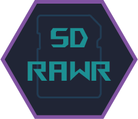
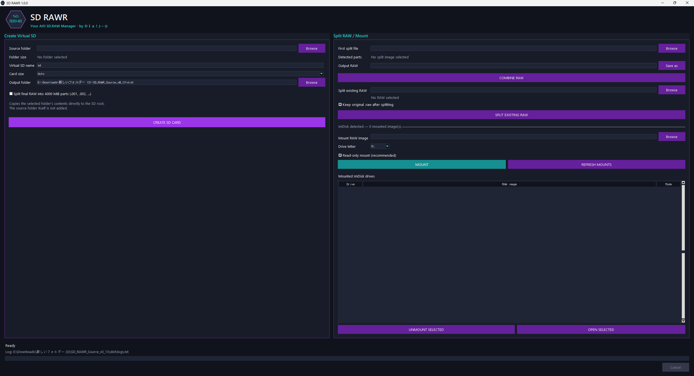

  

  

SD RAWR is a Windows utility for creating, splitting, combining, and mounting virtual SD card RAW images, mainly to be used with RiftWii, Dolphin and also Smash Brawl Mods

## Features

- Create FAT16/FAT32 `.raw` virtual SD card images from a folder
- Automatically choose the smallest supported SD card size that fits the source data (approximate)
- Copy the selected folder's contents directly into the root of the virtual SD card
- Split RAW images into 4000 MiB parts such as `.raw.001`, `.raw.002`, and so on (for RiftWiis FAT32 format)
- Split existing premade `.raw` files
- Combine split RAW parts back into the original `.raw` image
- Mount and unmount RAW images with ImDisk
- Read-only mounting by default, with optional read/write mounting
- Detect duplicate mounts of the same RAW image
- Show currently mounted ImDisk virtual drives
- Open mounted drives directly in Windows Explorer
- Live `logs.txt` file beside `SDRAWR.exe`

## Supported Virtual SD Sizes

128 MB, 256 MB, 512 MB, 1 GB, 2 GB, 4 GB, 8 GB, 16 GB, and 32 GB.

## Notes

ImDisk is required for mounting RAW images and is not bundled with SD RAWR.

## Usage:
Run the build_exe.bat to build the exe yourself with the source code or use the exe provided. Will need admin privileges. If you got a problem send your log.txt

# Credits

### SD RAWR

Application design, source code, UI, RAW creation/splitting/combining workflow, and Windows packaging.

The SD RAWR logo included with the project was supplied by the project owner and is used for the application window icon, executable icon, and in-app branding.

### pyfatfs

Used to create and work with FAT12/FAT16/FAT32 filesystems.

- Project: `pyfatfs`
- Author/project maintainers: Nathan Hi and contributors
- License: MIT
- Source: https://github.com/nathanhi/pyfatfs

### PyFilesystem2

Filesystem abstraction used by `pyfatfs`.

- Project: `PyFilesystem2`
- License: MIT
- Source: https://github.com/PyFilesystem/pyfilesystem2

### PyInstaller

Used to package SD RAWR into a standalone Windows executable.

- Project: `PyInstaller`
- License: GPL-2.0 with the PyInstaller exception, with some files under Apache-2.0
- The PyInstaller exception permits executables produced by PyInstaller to be distributed under the application's own license, subject to the licenses of bundled dependencies.
- Source: https://pyinstaller.org/

### ImDisk Virtual Disk Driver

Used as an **optional external dependency** for mounting and unmounting RAW images.

- Project: `ImDisk Virtual Disk Driver`
- Original author: Olof Lagerkvist
- Current source/project: LTR Data
- Source: https://github.com/LTRData/ImDisk

ImDisk is **not included in the SD RAWR distribution**. Users install it separately.

ImDisk contains code under multiple license terms. Its main source includes a permissive MIT-style license, while the project also contains GPL-licensed components and other third-party code. Refer to the ImDisk repository's `LICENSE.md` and source notices for the exact terms that apply to the version you install.

## License

SD RAWR is open-source software released under the MIT License.

See `LICENSE.txt` for the full license text.

## Disclaimer

SD RAWR is provided as-is and without warranty.

This software creates, modifies, splits, combines, and mounts disk image files.
Incorrect use, software bugs, filesystem corruption, interrupted operations, or
third-party driver behavior may result in data loss or damaged image files.

Always keep backups of important data before using SD RAWR.

The authors and contributors are not responsible for data loss, corrupted files,
system damage, lost work, or other damages resulting from the use or misuse of
this software.

Use SD RAWR at your own risk.
